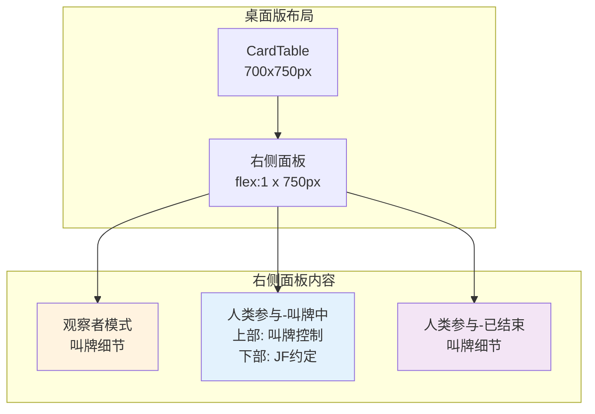

## 产品概述

重新设计并实现网页版桥牌叫牌练习系统的右侧面板布局，将叫牌控制、JF约定面板和叫牌细节合并为一个统一的面板。

## 核心功能

1. **统一右侧面板**：将叫牌控制、JF约定片段和叫牌细节整合到同一个右侧面板中
2. **智能切换逻辑**：

- 叫牌进行中（人类参与）：上部显示叫牌控制，下部显示JF约定片段
- 叫牌结束：切换为显示叫牌细节（完整历史记录）
- 观察者模式（无人类参与）：始终显示叫牌细节

3. **保留向后兼容**：`showAIBiddingOutput` 开关在观察者模式下仍然有效

## 详细需求

### 面板显示逻辑

| 场景 | 人类参与 | 叫牌状态 | 右侧面板显示内容 |
| --- | --- | --- | --- |
| 观察者模式 | 否 | 任意 | 叫牌细节（AI输出） |
| 人类参与 | 是 | 进行中 | 上部：叫牌控制，下部：JF约定 |
| 人类参与 | 是 | 已结束 | 叫牌细节（完整历史） |


### 布局要求

- 右侧面板总高度保持 750px
- 叫牌控制区域：固定高度约 280px（紧凑布局）
- JF约定区域：flex: 1，占剩余空间，overflow: auto
- 叫牌细节：占满整个 750px

### 交互细节

1. 叫牌控制按钮在 AI 回合时自动禁用
2. JF约定片段在人类回合时自动获取并显示
3. 叫牌结束后自动切换到叫牌细节视图
4. 保留"简单显示"模式切换功能

## 技术栈

- **前端框架**：React 18
- **UI组件库**：Material-UI (MUI) v5
- **状态管理**：React useState/useEffect hooks
- **样式方案**：MUI sx props + CSS 文件

## 实现方案

### 1. 修改 BiddingControls 组件

添加 `hideJFPanel` prop，允许父组件控制是否渲染 JF约定面板：

```
function BiddingControls({
  // ... 现有 props
  hideJFPanel = false,  // 新增：控制是否隐藏JF约定面板
})
```

当 `hideJFPanel=true` 时，只渲染叫牌控制部分，不渲染 JF约定 Paper。

### 2. 重构 App.jsx 桌面版右侧面板逻辑

新的右侧面板结构（伪代码）：

```
<Paper height=750px>
  {humanPosition === null ? (
    // 观察者模式：始终显示叫牌细节
    <BiddingDetailsPanel />
  ) : isBiddingComplete() ? (
    // 人类参与且叫牌结束：显示叫牌细节
    <BiddingDetailsPanel />
  ) : (
    // 人类参与且叫牌进行中：上部叫牌控制 + 下部JF约定
    <Box display=flex flexDirection=column height=100%>
      <Box height=280px>  // 叫牌控制区域
        <BiddingControls hideJFPanel=true isVerticalLayout=true />
      </Box>
      <Box flex=1 overflow=auto>  // JF约定区域
        <JFSuggestionPanel />
      </Box>
    </Box>
  )}
</Paper>
```

### 3. JF约定面板提取

将 JF约定片段的渲染逻辑从 BiddingControls 中提取，在 App.jsx 中直接内联渲染，便于控制布局。

### 4. 删除冗余代码

- 删除第 1808-1828 行的第二行 BiddingControls（原在叫牌细节下方）
- 删除 `showAIBiddingOutput` 相关的条件分支（第 1506-1805 行）

### 5. 保留设置面板中的开关

`showAIBiddingOutput` checkbox 保留，但修改其行为：

- 人类参与模式：该开关无效，始终使用新的合并面板
- 观察者模式：该开关控制是否显示叫牌细节（保持现有行为）

## 架构设计



## 目录结构

```
d:/Bridge Card/Bidding System/web/src/
├── App.jsx                    # [MODIFY] 重构右侧面板逻辑
└── components/
    └── BiddingControls.jsx    # [MODIFY] 添加 hideJFPanel prop
```

## 关键实现细节

### 高度计算

- 叫牌控制区域（isVerticalLayout=true）：约 280px
- 标题 + 状态：约 40px
- 紧凑叫牌按钮网格：4行 x 24px = 96px
- 自定义含义输入框：约 60px
- 提示信息：约 40px
- padding/margin：约 44px

- JF约定区域：flex: 1，占剩余空间（750 - 280 = 470px）

### 状态判断逻辑

```js
// 判断是否显示叫牌控制 + JF约定
const showBiddingControls = humanPosition !== null && !isBiddingComplete();

// 判断是否显示叫牌细节
const showBiddingDetails = humanPosition === null || isBiddingComplete();
```

### 向后兼容处理

```js
// 观察者模式下，showAIBiddingOutput 仍然有效
if (humanPosition === null && !showAIBiddingOutput) {
  // 显示空的占位区域或简化提示
}
```

## 设计思路

保持 Material Design 风格，与现有 UI 保持一致。右侧面板采用统一的 Paper 容器，内部根据状态切换显示内容。

### 面板布局

1. **叫牌控制区域**：

- 紧凑的叫牌按钮网格（5x4 + 特殊叫品）
- 当前叫牌者高亮显示
- 自定义叫牌含义输入框（可选）
- 状态提示（搭档已pass / 叫牌暂停）

2. **JF约定区域**：

- 标题：JF约定片段
- 检索关键字显示
- 约定内容滚动区域
- 加载状态指示器

3. **叫牌细节区域**：

- 标题 + 简单显示切换
- 叫牌记录下拉选择器
- 详细叫牌信息展示
- 牌局格式输出（结束后）

### 视觉层次

- 使用 MUI Paper 组件的 elevation 属性区分层次
- 叫牌控制：elevation=2
- JF约定：elevation=2
- 叫牌细节：elevation=3（作为主面板）