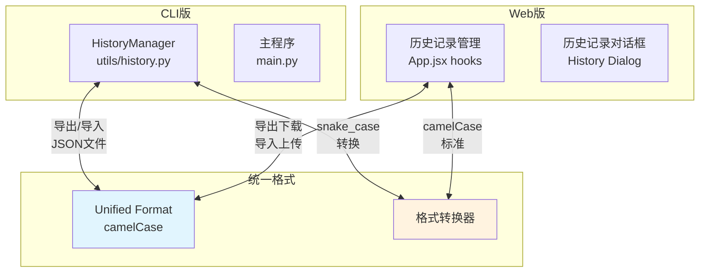

## 产品概述

重新设计并实现CLI版和Web版桥牌叫牌练习系统的历史记录导入导出功能，解决25号遇到的问题，实现跨平台数据共享。

## 核心功能

1. **统一记录格式**：设计兼容CLI和Web的统一JSON格式
2. **CLI导入/导出**：终端版添加导入导出菜单选项
3. **Web导入/导出**：网页版添加导入导出按钮
4. **格式转换**：自动处理snake_case和camelCase转换
5. **向后兼容**：支持导入旧格式记录

## 25号遇到的问题及解决方案

1. **网页版白屏问题**：原因是代码中存在使用旧格式 `record.result.bid` 的重复代码

- 解决：全面检查并统一使用新格式 `record.bid`

2. **加载历史记录后不显示手牌和点力**：历史记录的 `hands` 是字符串格式，但 `HandDisplay` 组件期望对象格式

- 解决：在Web版加载记录时添加格式转换逻辑

3. **字段命名不兼容**：新格式使用 camelCase，旧代码使用 snake_case

- 解决：创建格式转换器，自动识别并转换字段名

## 技术栈

- **CLI后端**：Python + 自定义HistoryManager
- **Web前端**：React + Material-UI
- **存储**：CLI使用文件系统(bidding_history.json)，Web使用localStorage(bridge_bidding_records)
- **数据格式**：JSON，统一使用camelCase作为标准格式

## 实现方案

### 1. 统一记录格式设计

采用camelCase命名规范，支持两个版本的所有字段：

```
{
  "id": "20260325002338",
  "timestamp": "2026-03-25 00:23:38",
  "hands": { "北": "♠543 ♥QT7...", "西": "...", "南": "...", "东": "..." },
  "biddingSequence": "(南)1NT-(西)pass-(北)pass-(东)pass",
  "dealer": "南",
  "gameMode": "双人叫牌",
  "humanPosition": "",
  "aiBiddingHistory": [...],
  "finalContract": "1NT (南家)",
  "note": "",
  "declarer": "南",
  "bidMeaning": "",
  "version": "1.0"
}
```

### 2. CLI版修改 (utils/history.py)

- 添加 `export_records(filepath)` 方法：导出所有记录到指定JSON文件
- 添加 `import_records(filepath)` 方法：从JSON文件导入记录，自动处理格式转换
- 添加 `_normalize_record(record)` 方法：将各种格式统一转换为标准格式
- 修改 `BiddingRecord`：支持从camelCase和snake_case初始化

### 3. CLI版修改 (main.py)

- 在历史记录菜单中添加选项：
- `e` - 导出历史记录到文件
- `i` - 从文件导入历史记录
- 添加导入导出交互逻辑

### 4. Web版修改 (web/src/App.jsx)

- 添加 `exportRecords()` 函数：将所有记录导出为JSON文件下载
- 添加 `importRecords(file)` 函数：从上传的JSON文件导入记录
- 在历史记录对话框中添加：
- "导出"按钮：导出所有记录
- "导入"按钮：打开文件选择器导入记录
- 添加格式转换逻辑，处理CLI版导入的记录

### 5. 格式转换器设计

创建通用的格式转换逻辑：

- snake_case → camelCase（CLI导出给Web使用）
- camelCase → snake_case（Web导出给CLI使用，可选）
- 旧格式检测和迁移

## 架构设计



## 目录结构

```
d:/Bridge Card/Bidding System/
├── utils/
│   └── history.py              # [MODIFY] 添加导入导出和格式转换
├── main.py                     # [MODIFY] 添加导入导出菜单
├── web/src/
│   ├── App.jsx                 # [MODIFY] 添加导入导出函数和按钮
│   └── utils/
│       └── recordConverter.js  # [NEW] 格式转换工具函数
└── shared/
    └── recordFormat.json       # [NEW] 统一格式定义文档
```

## 设计思路

在现有历史记录管理对话框中添加导入导出功能，保持UI风格一致性。

### Web版历史记录对话框修改

在历史记录列表顶部添加操作按钮栏：

- **导出按钮**：位于左上角，使用Download图标，点击后下载所有记录为JSON文件
- **导入按钮**：位于导出按钮右侧，使用Upload图标，点击后打开文件选择器
- **清空按钮**：移至右侧，保持原有功能

### 按钮样式

- 使用Material-UI的`Button`组件
- `variant="outlined"`样式，与现有"加载"按钮一致
- `size="small"`尺寸
- 图标使用`DownloadIcon`和`UploadIcon`

### 导入流程

1. 点击"导入"按钮，打开文件选择器（accept=".json"）
2. 选择文件后，解析JSON
3. 验证记录格式，自动转换旧格式
4. 合并到现有记录（去重：基于id）
5. 显示导入结果（成功/失败数量）

### 导出流程

1. 点击"导出"按钮
2. 将所有记录转换为统一格式
3. 生成JSON文件下载
4. 文件名：`bridge-records-YYYYMMDD-HHMMSS.json`